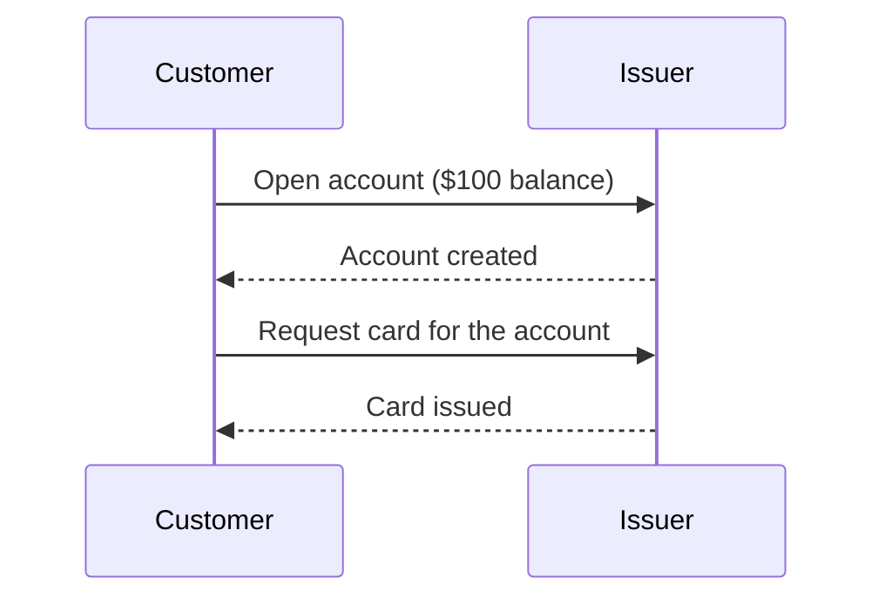
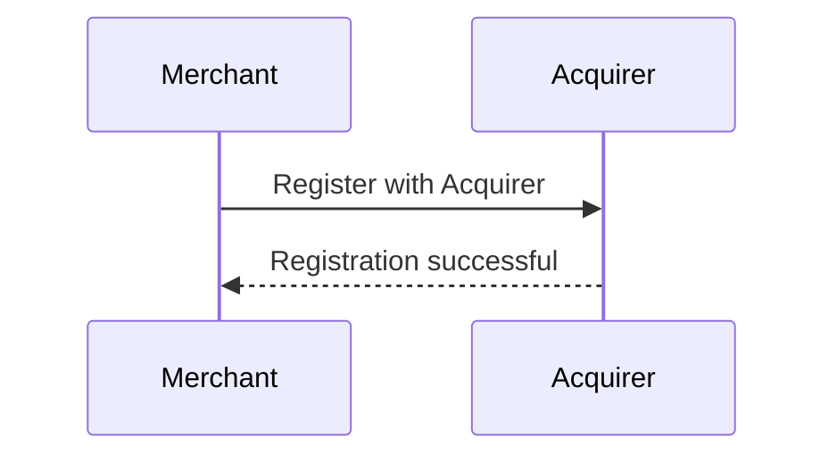
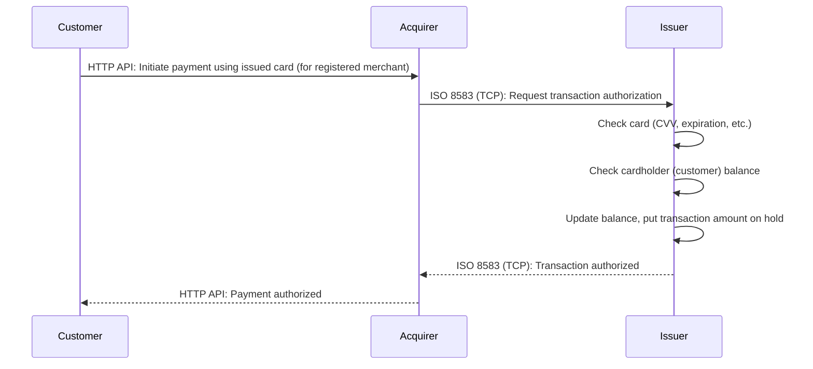

# CardFlow Playground

A learning environment for exploring card [acquiring](https://moov.io/resources/dictionary/#acquirer) and [issuing](https://moov.io/resources/dictionary/#issuer) systems built with Go.

## Overview

CardFlow Playground consists of two main applications:

1. Issuer: Manages accounts, cards, and transactions.
2. Acquirer: Manages merchants and processes payments.

Both applications communicate using the [ISO 8583](https://en.wikipedia.org/wiki/ISO_8583) standard, leveraging the following Go packages for efficient message handling and network management:

* [moov-io/iso8583](https://github.com/moov-io/iso8583) - A Golang library for packing and unpacking ISO 8583 messages, providing a seamless way to work with the standard message format.
* [moov-io/iso8583-connection](https://github.com/moov-io/iso8583-connection) - A Golang library that streamlines network management for ISO 8583, handling crucial tasks such as connection establishment, TLS configuration, heartbeat/echo/idle messaging, and request processing. Additionally, it features a connection pool with a re-connect capability to enhance reliability and performance.

## Out Of Scope

Please note that the following aspects are considered out of scope for this project:

1. **PCI and Security:** The project does not adhere to PCI compliance, and it handles sensitive data such as PANs, CVVs, and other card information in plain text. There is no implementation of Luhn algorithm, fraud checks, encryption, or other security measures.
1. **Simplified Model:** This project uses a simplified model for the transaction process, which means some parts may be missing or not fully implemented.
1. **Performance Optimization:** The primary focus of this project is on simplicity, readability and clarity rather than performance. As such, the code has not been optimized for performance or resource efficiency.
1. **Testing Coverage:** The project does not include comprehensive test coverage as would be expected in a production application. It is recommended to enhance the testing suite if you plan to use this project as a foundation for a production system.

## Features

- Create and manage accounts and cards for the issuer
- Create and manage merchants for the acquirer
- Process payments using ISO 8583
- End-to-end testing with both components

### End-to-end Transaction Flow

Here is the end-to-end test to showcase the integration between the Issuer and Acquirer.

1. Initialize the Issuer and Acquirer applications.
2. Configure the Issuer and Acquirer API clients.
3. Create an account with a `$100` balance in the Issuer.
4. Issue a card for the created account.
5. Create a new merchant for the Acquirer.
6. Process a payment request for the merchant using the issued card.
7. Verify that the payment is authorized in the Acquirer.
8. Verify that an authorized transaction exists in the Issuer for the card.
9. Check the transaction details to ensure they match the payment information.
10. Check the merchant details of the transaction to ensure they match the merchant information.
11. Verify that the account's available balance and hold balance have been updated accordingly.

The test case outlined in [e2e_test.go](./e2e_test.go) and demonstrates an end-to-end transaction flow between the Issuer and Acquirer applications. 

Here are the sequence diagrams for each part of the flow:

#### Customer opens a bank account and gets a card

#### Merchant registration with acquirer

#### Payment flow with Customer, Acquirer, and Issuer

## Directory Structure

The directory structure for issuer and acquirer is outlined below:

### Issuer

- `/issuer`: Contains the source code for the Issuer app.
  - `app.go`: Sets up and manages the application's lifecycle.
  - `api.go`: Implements the RESTful API.
  - `config.go`: Handles the configuration settings.
  - `service.go`: Contains the business logic for the Issuer.
  - `repository.go`: Manages data access (simplified in memory storage).
  - `/client`:
    - `client.go`: Implements the API client functionality.
  - `/iso8583`:
    - `authorization.go`: Contains types for ISO 8583 authorization request and response.
    - `server.go`: Implements the Issuer server functionality for ISO 8583.
    - `spec.go`: Defines the ISO 8583 specification for the Issuer.
  - `/models`: Contains data models for the Issuer component.
    - `account.go`: Represents an account, available and hold balances.
    - `approval_code.go`: Represents an approval code.
    - `authorization.go`: Represents an authorization.
    - `card.go`: Represents a card.
    - `merchant.go`: Represents a merchant.
    - `transaction.go`: Represents a transaction and transaction status.

### Acquirer

- `/acquirer`: Contains the source code for the Acquirer application.
  - `app.go`: Sets up and manages the application's lifecycle.
  - `api.go`: Implements the RESTful API.
  - `config.go`: Handles the app configuration settings.
  - `service.go`: Contains the business logic for the Acquirer.
  - `repository.go`: Manages data access.
  - `/client`:
    - `client.go`: Implements the API client functionality.
  - `/iso8583`:
    - `authorization.go`: Contains types for ISO 8583 authorization request and response.
    - `client.go`: Implements the ISO 8583 client for communication with the Issuer server.
    - `spec.go`: Defines the ISO 8583 specification for the Acquirer component (the spec is the same as for the Issuer).
    - `stan_generator.go`: Generates unique System Trace Audit Numbers (STANs) for ISO 8583 messages.
  - `/models`:
    - `authorization_response.go`: Represents an authorization response.
    - `card.go`: Represents a card.
    - `merchant.go`: Represents a merchant.
    - `payment.go`: Represents a payment.

## Usage

### Prerequisites

- Install Go version 1.20 or later

### Running the applications

1. Run `make build`
1. Start the issuer app with `./bin/issuer`
2. Start the acquirer app with `./bin/acquirer`

### Running Tests

Run the end-to-end tests with `go test -v`

## API Reference

### Issuer API

- `POST /accounts`: Create a new account
- `GET /accounts/:id`: Get an account by ID
- `POST /accounts/:id/cards`: Issue a new card for the account
- `GET /accounts/:id/transactions`: Get transactions for an account

### Postman Collection

After running both issuing and acquiring servers as described above, you can make requests from the following Postman collection:
https://www.postman.com/alovak/workspace/cardflow-playground/overview

### Acquirer API

- `POST /merchants`: Create a new merchant
- `POST /merchants/:id/payments`: Create a new payment for a merchant
- `GET /merchants/:id/payments/:id`: Get a payment by ID for a merchant

## License

This project is licensed under the MIT License - see the [LICENSE](LICENSE) file for details.
